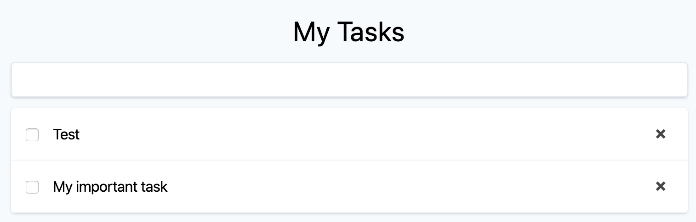
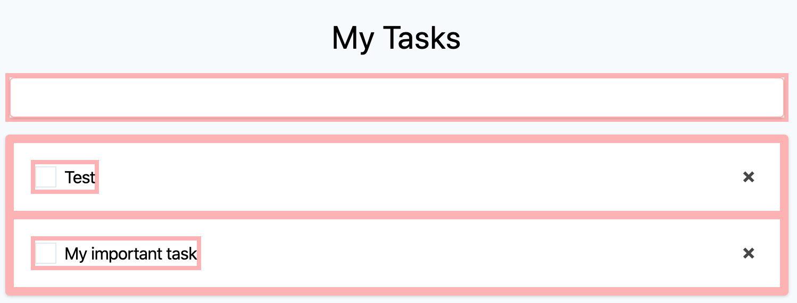
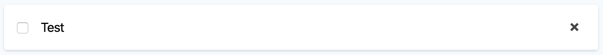
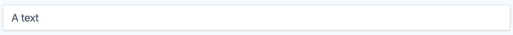
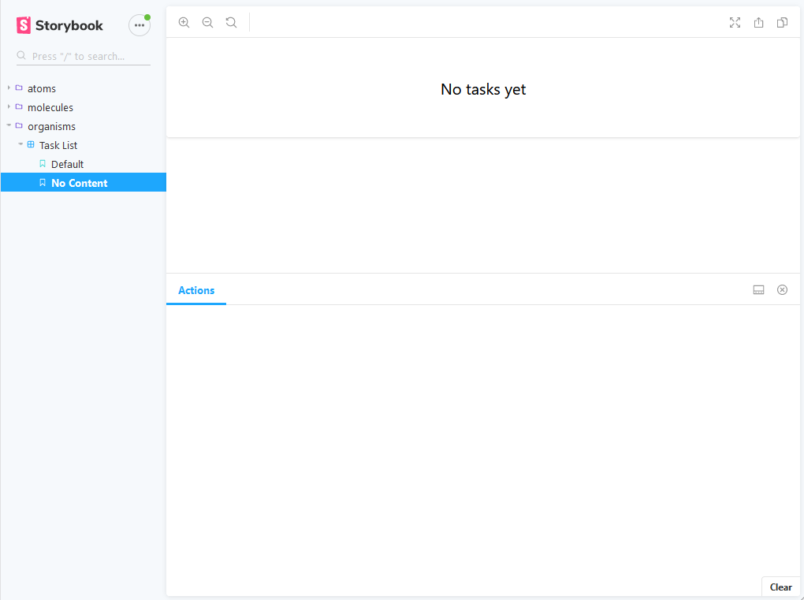

# Storybook JS
Developing UI components in isolation

<!-- .slide: class="master01" -->

---

# UI



<!-- .slide: class="master02" -->

----

## CDD / Atomic Design


<!-- Bottom Up -->
<!-- .slide: class="master02" -->

----



<!-- .slide: class="master02" -->


----

## Unabhängige Komponenten




<!-- .slide: class="master02" -->

---

# Storybook
- Playground
- Explorer
- Unabhängiges Entwickeln / Testen
- Dokumentation

<!-- .slide: class="master02" -->

----



<!-- .slide: class="master02" -->

----

## Integrationen

- React
- React Native
- Vue
- Angular
- Ember
- Svelte
- Mithril
- Riot
- Oder einfach plain JS/HTML

<!-- .slide: class="master02" -->

---

# Story erstellen
- Pro Komponente ein "Stories" File
<!-- .slide: class="master03" -->

----

## Altes Format

```js
storiesOf('Button', module)
  .add('Default', () => 
    `<button class="btn">Default Button</button>`
  )
```
<!-- .slide: class="master03" -->

----

## Component Story Format
```js
export default { title: 'Button' };

export const Default = () =>
  `<button class="btn">Default Button</button>`;
```
<!-- .slide: class="master03" -->

----

## Framework z.B Vue

```js
export default { title: 'Task' };

export const Default = () => ({
  components: { Task },
  template: '<task :task="task"></task>',
  data: () => ({ task: dummyTask }),
});
```
<!-- .slide: class="master03" -->

---

# Demo

<!-- .slide: class="master04" -->

---

# Testing

<!-- .slide: class="master04" -->

---

# Addons

<!-- .slide: class="master04" -->

---

# Links
https://storybook.js.org/
https://bradfrost.com/blog/post/atomic-web-design/
https://addyosmani.com/first/
https://www.learnstorybook.com/


<!-- .slide: class="master04" -->